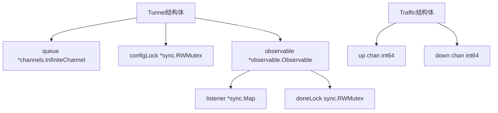

# Clash 并发设计分析

## 功能定位
分析Clash项目中并发处理的设计与实现，包括连接处理、配置管理、流量统计等关键模块的并发控制机制。该项目通过goroutine、channel、sync包等Go语言特性实现了高性能的网络代理服务。

## 核心并发设计模式

### 1. 单例模式与并发安全
项目使用`sync.Once`确保[Tunnel](file:///C:/go-pj/clash-read/tunnel/tunnel.go#L36-L50)实例只被创建一次，保证全局唯一性：

```go
var (
    tunnel *Tunnel
    once   sync.Once
)

func GetInstance() *Tunnel {
    once.Do(func() {
        tunnel = newTunnel()
    })
    return tunnel
}
```

### 2. 读写锁优化读多写少场景
配置读取使用读写锁(`sync.RWMutex`)优化并发性能，允许多个goroutine同时读取配置：

```go
func (t *Tunnel) match(addr *C.Addr) C.Proxy {
    // 加读锁保护配置读取
    t.configLock.RLock()
    defer t.configLock.RUnlock()
    // ... 匹配逻辑
}
```

### 3. 生产者-消费者模式处理连接
使用[channel](file:///C:/go-pj/clash-read/tunnel/tunnel.go#L41-L41)实现生产者-消费者模式处理连接请求，通过`channels.InfiniteChannel`缓冲连接请求：

```go
func (t *Tunnel) process() {
    queue := t.queue.Out()
    for {
        elm := <-queue
        conn := elm.(C.ServerAdapter)
        // 异步处理连接
        go t.handleConn(conn)
    }
}
```

## 函数调用树（核心并发聚焦版）

```
+ tunnel.GetInstance()
  +--- sync.Once.Do() # 单例初始化
       +--- newTunnel()
            +--- channels.NewInfiniteChannel() # 连接队列
            +--- sync.RWMutex{} # 配置锁
            +--- go tunnel.process() # 连接处理协程
            +--- go tunnel.subscribeLogs() # 日志处理协程

+ tunnel.process()
  +--- queue.Out() # 获取连接队列
  +--- go tunnel.handleConn() # 每个连接一个goroutine

+ tunnel.handleConn()
  +--- tunnel.match() # 规则匹配
       +--- configLock.RLock() # 读锁保护配置

+ tunnel.UpdateConfig()
  +--- configLock.Lock() # 写锁保护配置更新
```

## 核心实现流程

### [阶段 1] 连接处理并发模型
1. **连接接收阶段**
   - 调用链：`SOCKS/HTTP Proxy -> tun.Add() -> queue.In()`
   - 技术实现：每个新连接通过[channel](file:///C:/go-pj/clash-read/tunnel/tunnel.go#L41-L41)放入处理队列

2. **连接处理阶段**
   - 调用链：`process() -> handleConn() -> go handleConn()`
   - 技术实现：每个连接在独立的goroutine中处理，实现高并发

3. **数据传输阶段**
   - 调用链：`localConn.Connect() -> io.Copy()`
   - 技术实现：使用两个goroutine实现双向数据复制
   ```go
   go io.Copy(s.conn, proxy.ReadWriter())
   io.Copy(proxy.ReadWriter(), s.conn)
   ```

### [阶段 2] 配置管理并发控制
1. **配置读取阶段**
   - 调用链：`match() -> configLock.RLock()`
   - 技术实现：使用读写锁的读锁，允许多个读操作并发执行

2. **配置更新阶段**
   - 调用链：`UpdateConfig() -> configLock.Lock()`
   - 技术实现：使用读写锁的写锁，独占访问防止读写冲突

### [阶段 3] 流量统计并发安全
1. **流量记录阶段**
   - 核心逻辑：`TrafficTrack.Read/Write() -> traffic.Up()/Down()`
   - 技术实现：通过[channel](file:///C:/go-pj/clash-read/tunnel/tunnel.go#L41-L41)传递流量数据，避免直接共享内存

2. **流量聚合阶段**
   - 调用链：`Traffic.handle() -> handleCh() -> ticker`
   - 技术实现：使用定时器定期聚合流量数据

## 技术设计矩阵

| 设计点 | 实现方式 | 优缺点 | 适用场景 |
|--------|----------|--------|----------|
| 连接处理 | goroutine per connection | 高并发，但可能消耗较多资源 | 网络代理服务 |
| 配置同步 | sync.RWMutex | 读多写少场景优化，读操作可并发 | 配置管理 |
| 单例模式 | sync.Once | 线程安全的单次初始化 | 全局唯一实例 |
| 观察者模式 | sync.Map + channel | 线程安全的订阅发布 | 日志系统 |

## 数据结构关键设计



## 外部依赖

- 强依赖包：`gopkg.in/eapache/channels.v1` - 提供无限缓冲[channel](file:///C:/go-pj/clash-read/tunnel/tunnel.go#L41-L41)
- 强依赖包：`sync` - 提供并发原语
- 弱依赖包：`github.com/sirupsen/logrus` - 日志处理

## 风险提示

> !IMPORTANT 特别注意：
> - [连接处理goroutine泄漏风险] - 每个连接启动一个goroutine，大量连接可能导致资源耗尽
> - [配置更新时旧连接处理] - 配置更新时正在处理的连接可能使用旧配置
> - [URLTest代理组并发测试] - 多个代理并发测试可能产生较大网络负载

## 执行保障机制

1. **goroutine管理**：通过[channel](file:///C:/go-pj/clash-read/tunnel/tunnel.go#L41-L41)机制和生命周期管理控制goroutine
2. **资源回收**：连接处理完成后自动关闭连接和相关资源
3. **并发测试**：[observable/observable_test.go](file:///C:/go-pj/clash-read/observable/observable_test.go)包含并发安全测试用例