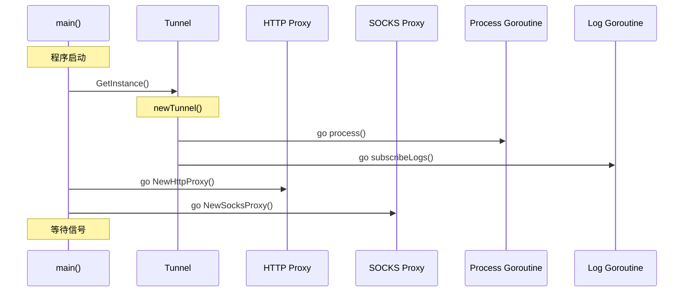
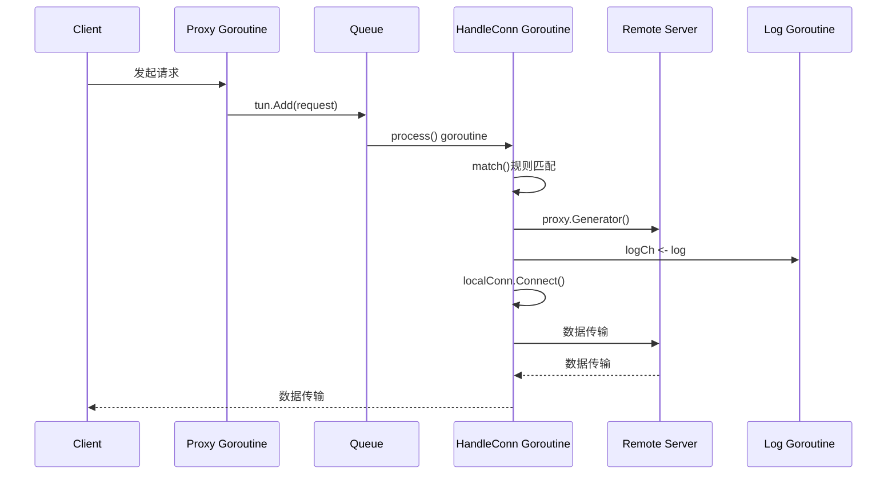
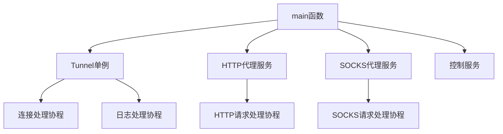
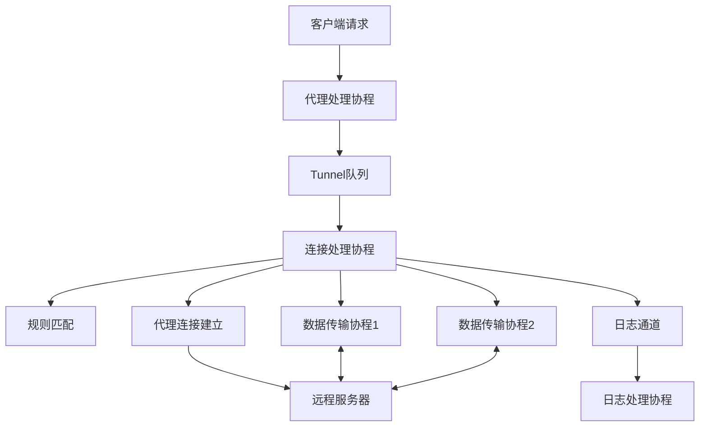

# Clash 系统启动与请求处理流程分析

## 功能定位
详细分析Clash项目从系统启动到处理网络请求的完整流程，包括对象构建顺序、线程协程交互关系以及关键组件的协作机制。

## 系统启动流程

### 1. 程序入口
程序从[main.go](file:///C:/go-pj/clash-read/main.go)开始执行：

```go
func main() {
    // 1. 加载配置文件
    cfg, err := C.GetConfig()
    if err != nil {
        log.Fatalf("Read config error: %s", err.Error())
    }

    // 2. 解析端口配置
    port, socksPort := C.DefalutHTTPPort, C.DefalutSOCKSPort
    section := cfg.Section("General")
    if key, err := section.GetKey("port"); err == nil {
        port = key.Value()
    }

    if key, err := section.GetKey("socks-port"); err == nil {
        socksPort = key.Value()
    }

    // 3. 更新隧道配置
    err = tunnel.GetInstance().UpdateConfig()
    if err != nil {
        log.Fatalf("Parse config error: %s", err.Error())
    }

    // 4. 启动HTTP代理服务
    go http.NewHttpProxy(port)
    
    // 5. 启动SOCKS代理服务
    go socks.NewSocksProxy(socksPort)

    // 6. 启动控制服务（可选）
    if key, err := section.GetKey("external-controller"); err == nil {
        go hub.NewHub(key.Value())
    }

    // 7. 等待退出信号
    sigCh := make(chan os.Signal, 1)
    signal.Notify(sigCh, syscall.SIGINT, syscall.SIGTERM)
    <-sigCh
}
```

### 2. Tunnel对象构建流程
Tunnel是系统的核心组件，使用单例模式构建：

```go
// 第一次调用GetInstance()时触发构建
func GetInstance() *Tunnel {
    once.Do(func() {
        tunnel = newTunnel()
    })
    return tunnel
}

func newTunnel() *Tunnel {
    // 1. 创建日志通道
    logCh := make(chan interface{})

    // 2. 初始化Tunnel结构体
    tunnel := &Tunnel{
        queue:      channels.NewInfiniteChannel(),   // 连接请求队列
        proxys:     make(map[string]C.Proxy),        // 代理映射
        observable: observable.NewObservable(logCh), // 日志观察者
        logCh:      logCh,                           // 日志通道
        configLock: &sync.RWMutex{},                 // 配置读写锁
        traffic:    C.NewTraffic(time.Second),       // 流量统计器
    }

    // 3. 启动连接处理协程
    go tunnel.process()

    // 4. 启动日志订阅协程
    go tunnel.subscribeLogs()

    return tunnel
}
```

### 3. 代理服务启动流程

#### HTTP代理启动
```go
func NewHttpProxy(port string) {
    server := &http.Server{
        Addr: fmt.Sprintf(":%s", port),
        Handler: http.HandlerFunc(func(w http.ResponseWriter, r *http.Request) {
            if r.Method == http.MethodConnect {
                handleTunneling(w, r)  // HTTPS CONNECT请求
            } else {
                handleHTTP(w, r)       // 普通HTTP请求
            }
        }),
    }
    log.Infof("HTTP proxy :%s", port)
    server.ListenAndServe()  // 启动HTTP服务监听
}
```

#### SOCKS代理启动
```go
func NewSocksProxy(port string) {
    l, err := net.Listen("tcp", fmt.Sprintf(":%s", port))
    defer l.Close()
    if err != nil {
        return
    }
    log.Infof("SOCKS proxy :%s", port)
    for {
        c, err := l.Accept()  // 接受连接
        if err != nil {
            continue
        }
        go handleSocks(c)     // 每个连接一个goroutine处理
    }
}
```

## 网络请求处理流程

### 1. HTTP请求处理流程

#### 普通HTTP请求
```go
func handleHTTP(w http.ResponseWriter, r *http.Request) {
    // 1. 获取目标地址
    addr := r.Host
    if !strings.Contains(addr, ":") {
        addr += ":80"
    }

    // 2. 创建HTTP适配器
    req, done := NewHttp(addr, w, r)

    // 3. 添加到Tunnel处理队列
    tun.Add(req)

    // 4. 等待处理完成
    <-done
}
```

#### HTTPS CONNECT请求
```go
func handleTunneling(w http.ResponseWriter, r *http.Request) {
    // 1. 劫持连接
    hijacker, ok := w.(http.Hijacker)
    if !ok {
        return
    }
    conn, _, err := hijacker.Hijack()
    if err != nil {
        return
    }

    // 2. 发送连接建立成功响应
    conn.Write([]byte("HTTP/1.1 200 OK\r\n\r\n"))

    // 3. 创建HTTPS适配器并添加到处理队列
    tun.Add(NewHttps(r.Host, conn))
}
```

### 2. SOCKS请求处理流程
```go
func handleSocks(conn net.Conn) {
    // 1. SOCKS握手
    target, err := socks.Handshake(conn)
    if err != nil {
        conn.Close()
        return
    }
    conn.(*net.TCPConn).SetKeepAlive(true)

    // 2. 创建SOCKS适配器并添加到处理队列
    tun.Add(NewSocks(target, conn))
}
```

### 3. Tunnel连接处理流程
```go
func (t *Tunnel) process() {
    queue := t.queue.Out()
    for {
        // 1. 从队列获取连接请求
        elm := <-queue
        conn := elm.(C.ServerAdapter)
        
        // 2. 每个连接启动一个goroutine处理
        go t.handleConn(conn)
    }
}

func (t *Tunnel) handleConn(localConn C.ServerAdapter) {
    // 1. 函数结束时关闭本地连接
    defer localConn.Close()

    // 2. 获取连接目标地址
    addr := localConn.Addr()

    // 3. 根据规则匹配代理
    proxy := t.match(addr)

    // 4. 使用选中代理建立远程连接
    remoConn, err := proxy.Generator(addr)
    if err != nil {
        t.logCh <- newLog(WARNING, "Proxy connect error: %s", err.Error())
        return
    }
    
    // 5. 函数结束时关闭远程连接
    defer remoConn.Close()

    // 6. 连接本地和远程，开始数据传输
    localConn.Connect(remoConn)
}
```

## 对象构建时序图



## 请求处理协程交互图



## 核心组件交互关系

### 1. 启动阶段对象依赖关系


### 2. 请求处理阶段对象交互关系


## 关键并发控制机制

### 1. Tunnel单例控制
使用`sync.Once`确保全局只有一个Tunnel实例：

```go
var (
    tunnel *Tunnel
    once   sync.Once  // 单例控制
)

func GetInstance() *Tunnel {
    once.Do(func() {  // 线程安全的单次执行
        tunnel = newTunnel()
    })
    return tunnel
}
```

### 2. 配置并发访问控制
使用读写锁控制配置的并发访问：

```go
// 读取配置时加读锁
func (t *Tunnel) match(addr *C.Addr) C.Proxy {
    t.configLock.RLock()
    defer t.configLock.RUnlock()
    // 多个goroutine可以同时读取配置
}

// 更新配置时加写锁
func (t *Tunnel) UpdateConfig() (err error) {
    // ...
    t.configLock.Lock()
    defer t.configLock.Unlock()
    // 独占访问，防止读写冲突
}
```

### 3. 日志系统并发处理
使用观察者模式实现线程安全的日志处理：

```go
// 日志生产者
t.logCh <- newLog(INFO, "日志信息")

// 日志消费者
func (t *Tunnel) subscribeLogs() {
    sub, err := t.observable.Subscribe()
    if err != nil {
        log.Fatalf("Can't subscribe tunnel log: %s", err.Error())
    }
    for elm := range sub {  // 每个订阅者独立处理
        data := elm.(Log)
        print(data)
    }
}
```

## 性能与资源管理

### 1. Goroutine生命周期管理
每个连接处理完成后自动释放资源：

```go
func (t *Tunnel) handleConn(localConn C.ServerAdapter) {
    defer localConn.Close()  // 处理完成后自动关闭连接
    
    // ...
    
    defer remoConn.Close()   // 处理完成后自动关闭远程连接
    
    // ...
}
```

### 2. 连接复用与数据传输
使用两个goroutine实现双向数据传输：

```go
func (s *SocksAdapter) Connect(proxy C.ProxyAdapter) {
    // 一个goroutine处理从远程到本地的数据流
    go io.Copy(s.conn, proxy.ReadWriter())
    // 当前goroutine处理从本地到远程的数据流
    io.Copy(proxy.ReadWriter(), s.conn)
}
```

## 外部依赖

- 核心依赖：`gopkg.in/eapache/channels.v1` - 提供无限缓冲队列
- 核心依赖：`sync` - 提供并发原语
- 网络库：`net` - 处理网络连接
- 日志库：`github.com/sirupsen/logrus` - 日志处理

## 风险提示

> !IMPORTANT 特别注意：
> - [Goroutine资源消耗] - 每个连接启动一个goroutine，在高并发场景下可能消耗大量资源
> - [连接泄漏风险] - 需确保每个连接处理完成后正确关闭所有资源
> - [配置更新一致性] - 配置更新时正在处理的连接可能使用旧配置